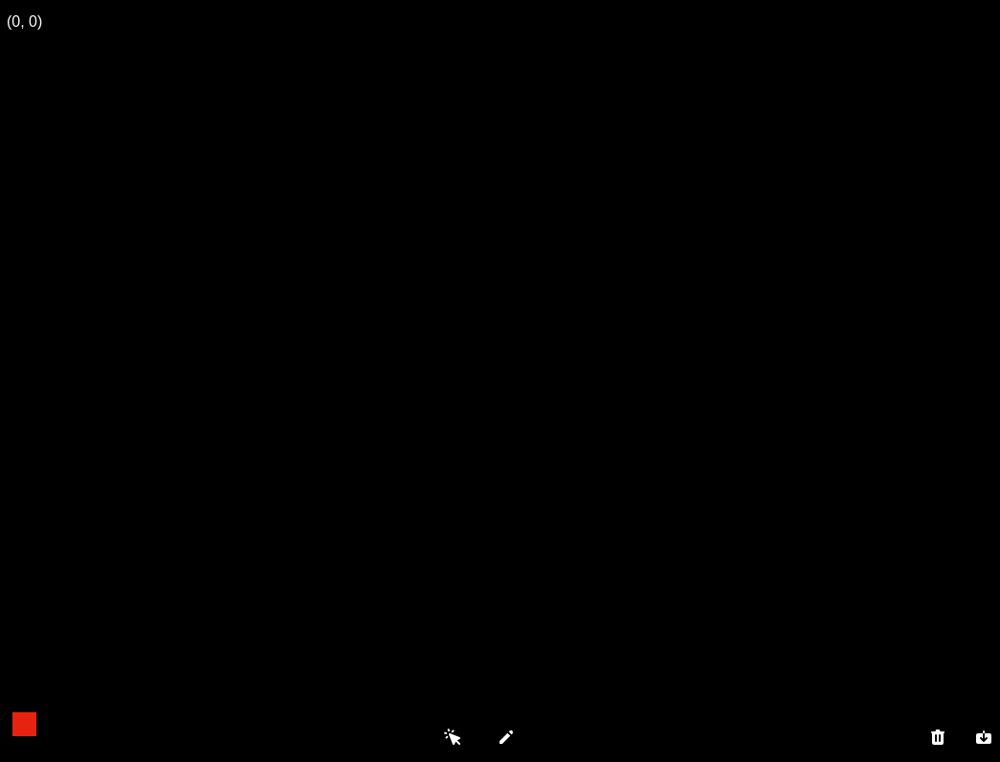

# devsketch

👩‍🎨 Create digital artwork on a canvas on the web!

## Demo

🚀 https://devsketch.netlify.app/

## Features

### User stories

1. ✅ User can draw in a canvas using the mouse
2. ✅ User can change the color
3. ✅ User can change the size of the tool
4. ✅ User can press a button to clear the canvas

### Bonus features

1. ✅ User can save the artwork as an image
2. ✅ User can draw on a infinite scrolling canvas
3. ✅ User can see an appropirate cursor (their active tool)
4. ✅ User can undo an action, by pressing the key `z`
5. ✅ User can redo an action, by pressing the key `y`

## Implementation

Built with JavaScript, CSS and [P5.js](https://p5js.org/).

Initially, I was using the standard Canvas APIs, it was a bit tricky, so I ended up finding P5.js which provides a super simple API and abstraction over the Canvas API and allowed me to focus on working on the features instead. Generally, I'm pretty happy with that choice, there were a few things that I struggled with. One of those struggles was interactions, I had user interface that was rendered above the canvas (z-index) which lead to some accidental drawings if the interaction ended up on the canvas. I solved this by rendering the toolbar below the canvas, and had to rework one of the UI pieces to not go over the canvas. I'm a bit disappointed on the latter, as I really liked that UI, but the behavior was super annoying so I made a trade off given the time constraints.

The undo and redo functionality uses a simple stack data structure, whenever you press `z` the latest action or drawing you did is removed and inserted into a separate stack. If you press `y`, we take the latest item from that stack and move it back. The undo and redo seems to work seamlessly so I'm happy about that.

Finally, I'm happy about the infinite scrolling canvas which was much simpler than I first anticipated, I simply track top-left corner x and y, and whenever you drag the mouse I offset from there. All drawings x and y are stored with that offset and when those are rendered I simply substract the offset to find the viewport's x and y for that specific drawing. I remember how much I struggled with this simple math when I was younger and an "aspiring game developer" :P
